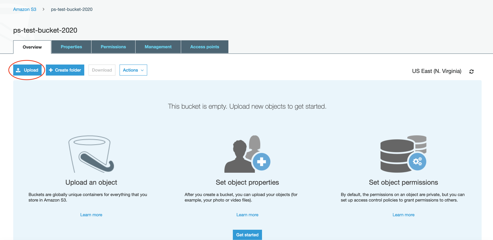

# Project purpose

At the end of this project, you should have been able to:

* Create a new S3 Bucket in your AWS account.
* Add an object to the S3 Bucket.

# Pre-requisites and setup

For this project you'll need:

* An AWS account: If you don't have one, you can create it going to [this link](https://portal.aws.amazon.com/gp/aws/developer/registration/index.html)
* A computer with Linux or MacOS installed
* `nvm` installed on your local machine: If you don't have it, you can install it following the instructions on [this link](https://github.com/nvm-sh/nvm#install--update-script)
* Once you have `nvm` installed, you can install `node v12.4.0` on your machine, running the following command:

```bash
nvm install v12.4.0
```

* Then, on the project root, execute the following command for selecting the appropriate node version for the project:

```bash
nvm use
```

* Finally, install project dependencies using:

```bash
npm install
```

# Running tests

For checking that tasks have been completed correctly, you can run:

```bash
npm test
```

# Tasks

## Task 1: Create a new administrator user on AWS and configure AWS credentials on your local machine

For creating an administrator user in your AWS account, follow these steps:

1. In the AWS console, go to the IAM Service.


2. In the navigation pane, choose `Users` and then click on `Add user`.


3. For `User name`, type `administrator`. Select the check box next to AWS Management Console access,
leave the `Autogenerated password` option selected and also make sure the `Users must create a new password at next sign-in`
is selected. Then, click on `Next: Permissions`.


4. On the `Set permissions page`, choose `Add user to group`, and then `Create group`.


5. In the `Create group` dialog box, type `admins` as the Group name. In the policy list, select the check box for
`AdministratorAccess`. Then choose `Create group`.


6. Back in the list of groups, select the check box for your new group and choose `Next: Tags`.


7. Choose `Next: Review` to see the list of group memberships to be added to the new user.


8. When you are ready to proceed, choose `Create user`.


9. After the user is created, a page with the autogenerated password and the URL for logging in will be displayed.
Make sure to copy the password and click on the URL, that will redirect you to the Login page.


10. Now, login with the `administrator` user and the password you’ve also just copied. A new page asking you to change
the autogenerated password will be displayed, write the old password and the new password you want, and click on
`Confirm password change`.


11. Now, you'll need to create an Access Key (this is for tests being able to call the AWS API and check that you have completed the tasks
correctly). For that, in the AWS console, click on your user name located in the top bar and then on `My security credentials`.


12. On the next page, under the `Access keys for CLI, SDK, & API access` section, click on `Create access key`.


13. Make sure to copy the `Access Key ID`, and click on `Show secret access key` for copying the `Secret access key`.


14. Now, create a new `credentials` file in `~/.aws/credentials` (or open the file if it already exists), and then add the
following content:

 ```
 [ps_test]
 aws_access_key_id = YOUR_ACCESS_KEY_ID
 aws_secret_access_key = YOUR_SECRET_ACCESS_KEY
 ```


## Task 2: Create a S3 bucket

1. To create an S3 bucket, go to the S3 service.


2. Click on Create bucket.


3. The bucket name should be `ps-test-bucket-2020`. Then you have to select the Region. For this project, let's work on
the US East North Virginia region (also known as us-east-1) and click on `Next`.


4. Leave everything as is on the `Configure options` page and click on `Next`.


5. The same for the `Set permissions` page, leave everything as is for blocking public access and click on `Next`.


6. And finally, click on `Create bucket` and you should be good to go.


## Task 3: Create a new object under the created S3 Bucket

1. Now, create a txt file with your favorite editor, name it `test-file.txt` and write `Hello World!` inside it. Make
sure you write that text exactly as shown.

2. Back to the S3 console, click on the bucket you have just created for opening it, and then click in the `Upload` button.



3. Then, click in the `Add files` button


4. Now, select the `test-file.txt` file and click on `Next`.


5. On the `Set permissions` page, click on `Next`.


6. On the `Set properties` page, click on `Next`.


7. And finally, on the review page, click on `Upload`, and that should be it.


